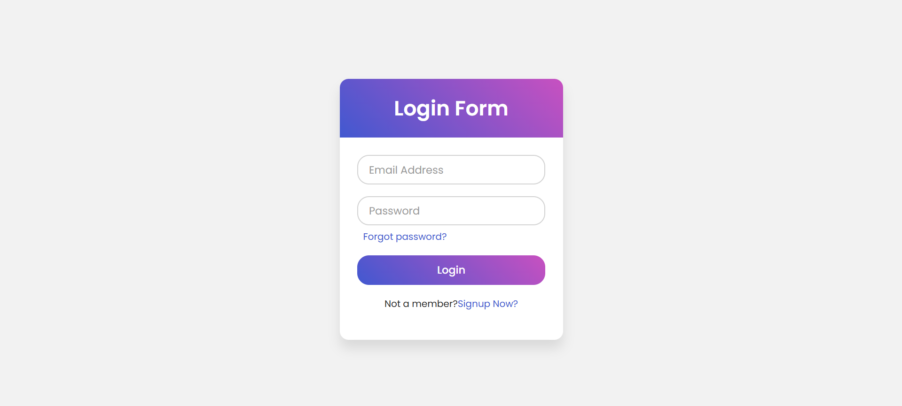

# 🔐 Login Form UI

A modern and responsive **Login Form UI** built using **HTML & CSS** with smooth animations and a clean design.

---

## 📸 Preview

> 💡 Add a screenshot of your project and name it `preview.png` in your project folder.

---

## 🚀 Features

- ✨ Clean and modern UI design  
- 🎨 Gradient header styling  
- 🔄 Floating label animation  
- 📱 Responsive layout  
- 🔒 Password input field  
- 🔗 "Forgot Password" & Signup links  
- ⚡ Smooth input focus effects  

---

## 🛠️ Technologies Used

- HTML5  
- CSS3  
- Google Fonts (Poppins)  

---
## ▶️ How to Use

1. Download or clone the repository  
2. Open `index.html` in your browser  
3. Customize as needed  

---

## 📌 Future Improvements

- Add backend authentication  
- Form validation with JavaScript  
- Dark mode toggle  
- API integration  

---

## 🙌 Author

Made with ❤️ by You